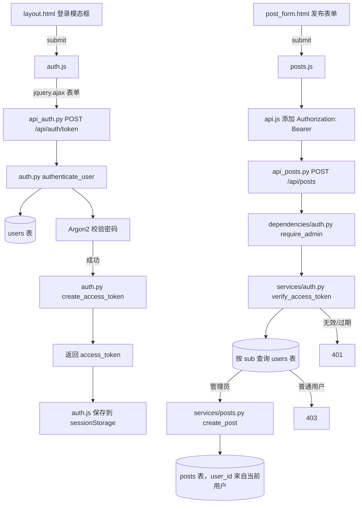

# JWT 与用户认证开发技术流程

本文描述当前已经实现的 JWT Access Token 登录、校验和发帖授权链路。帖子新增、修改和删除要求管理员 Bearer Token。

## 1. 开发目标与边界

第一阶段实现以下能力：

- 用户使用用户名和密码登录。
- 服务端验证密码后签发短期 JWT Access Token。
- 客户端通过 `Authorization: Bearer <token>` 访问受保护接口。
- 依赖函数解析 Token 并加载当前用户。
- 使用 `is_admin` 区分普通用户与管理员。
- 密码哈希、JWT 和数据库错误不会泄露到响应或日志。

第一阶段暂不实现：

- Refresh Token。
- Token 黑名单和主动注销失效。
- 第三方 OAuth 登录。
- 邮箱验证、找回密码、多因素认证。
- 多角色 RBAC 权限表。

JWT 是无状态凭据。只实现 Access Token 时，“退出登录”只能由客户端删除 Token；已签发 Token 在过期前仍然有效。确实需要服务端撤销能力时，再设计 Refresh Token 或 Token 版本机制。

## 2. 现有基础

| 现有内容 | 文件或依赖 | 用途 |
| --- | --- | --- |
| 用户表 | `app/models/user.py` | 保存用户名、邮箱、密码哈希和 `is_admin` |
| 密码哈希 | `pwdlib[argon2]` | 注册时生成 Argon2 哈希，登录时验证密码 |
| JWT | `PyJWT` | 编码和解码 Access Token |
| 安全配置 | `app/core/config.py` | 提供 `SECRET_KEY`、`ALGORITHM`、过期分钟数 |
| 数据库依赖 | `app/db/session.py` | 为认证依赖和登录 Service 提供 Session |

`.env` 中的 `SECRET_KEY` 已被 Git 忽略。生产环境应由部署平台注入独立密钥，不能复制开发密钥，也不能将密钥写进代码、镜像或日志。

## 3. 已实现的模块

以下文件构成当前认证实现：

| 文件 | 计划职责 |
| --- | --- |
| `app/schemas/auth.py` | 定义 `TokenResponse` 响应契约 |
| `app/services/auth.py` | 验证 Argon2 密码、创建和解码 JWT |
| `app/dependencies/auth.py` | 提取 Bearer Token、加载当前用户并检查管理员权限 |
| `app/routers/api_auth.py` | 提供 `POST /api/auth/token` 登录接口 |
| `app/static/js/api.js` | 使用 `jquery.ajax` 封装 JSON、表单和 Bearer Header |
| `app/static/js/auth.js` | 提交登录/注册表单并管理当前标签页 Token |
| `app/static/js/posts.js` | 携带 Token 提交发布和编辑帖子表单 |
| `app/static/js/forms.js` | 使用 AJAX 提交搜索和个人资料表单 |
| `tests/test_auth.py` | 覆盖登录、Token 过期/伪造以及发帖权限 |

## 3.1 编程代码流程图



编写时先完成签发链，再完成验证链，最后把业务写接口接到权限依赖：

1. `schemas/auth.py` 先固定登录响应，防止 Router 随意暴露字段。
2. `services/auth.py` 完成密码验证及 JWT 编解码；`sub` 只保存用户主键。
3. `routers/api_auth.py` 解析 OAuth2 表单，认证成功才签发 Token。
4. `dependencies/auth.py` 从 Header 提取 Token、查库获得最新用户，并区分 401 与 403。
5. `routers/api_posts.py` 依赖 `require_admin`，用当前用户 ID 生成 `PostCreate`，不信任前端作者 ID。
6. `api.js` 统一封装 AJAX；具体表单模块只负责收集字段、展示错误和页面跳转。
7. `tests/test_auth.py` 验证正确登录、错误凭据、过期/伪造 Token、普通用户 403 和管理员成功。

`sessionStorage` 会在当前标签页关闭后清除，比永久保存更收敛，但仍可被同源 JavaScript 读取，因此生产环境还必须严格防范 XSS 并启用 HTTPS。

第一阶段不需要修改用户表，也不需要新增数据库迁移。只有未来增加 Refresh Token、Token 版本、账号禁用或登录审计字段时，才需要新迁移。

## 4. 登录与签发 Token

登录接口使用 FastAPI 的 `OAuth2PasswordRequestForm`，请求类型为 `application/x-www-form-urlencoded`：

```http
POST /api/auth/token
Content-Type: application/x-www-form-urlencoded

username=alice&password=password123
```

虽然 OAuth2 表单字段固定名为 `username`，Service 可以决定只允许用户名，或同时接受用户名和邮箱。为避免规则含糊，第一阶段建议只允许用户名登录；需要邮箱登录时再明确加入规范化查询和对应测试。

调用链：

```text
POST /api/auth/token
  → OAuth2PasswordRequestForm 解析 username/password
  → auth_service.authenticate_user()
      → 按 username 查询 User
      → verify_password(明文密码, hashed_password)
  → 验证失败：401 + WWW-Authenticate: Bearer
  → 验证成功：create_access_token(user.id)
      → 加入 sub、iat、exp
      → 使用 SECRET_KEY 和固定 ALGORITHM 签名
  → TokenResponse(access_token, token_type="bearer")
```

无论用户名不存在还是密码错误，都返回相同的 `401 Invalid username or password`，避免攻击者通过响应差异枚举账号。

## 5. JWT Payload 设计

第一阶段只放必要声明：

```json
{
  "sub": "123",
  "iat": 1784700000,
  "exp": 1784701800
}
```

| Claim | 含义 |
| --- | --- |
| `sub` | 用户主键，统一编码为字符串 |
| `iat` | Token 签发时间，使用带时区的 UTC 时间 |
| `exp` | Token 过期时间，由 `ACCESS_TOKEN_EXPIRE_MINUTES` 计算 |

不要把密码哈希、邮箱、昵称或管理员状态放入 Token。`is_admin` 可能在 Token 有效期内被修改，授权时应从数据库读取当前用户，以数据库状态为准。

如果以后存在多个签发方或多个 API，再考虑增加 `iss` 和 `aud`；增加后编码和解码两端必须同时严格校验。

## 6. Token 编码与解码规则

编码时：

1. 从 `Settings` 读取 `SECRET_KEY`、`ALGORITHM` 和有效期。
2. 使用 `datetime.now(UTC)` 计算 `iat` 和 `exp`。
3. 调用 `jwt.encode(payload, secret, algorithm=algorithm)`。

解码时：

1. 从 Bearer Header 取得 Token。
2. 调用 `jwt.decode(token, secret, algorithms=[settings.algorithm])`。
3. 必须显式传入允许的算法列表，不能信任 Token Header 自己声明的算法。
4. 捕获过期、签名错误、格式错误和缺少 `sub`，统一转换成 `401`。
5. 将 `sub` 转换为整数并查询数据库；用户不存在也返回 `401`。

不要在日志中记录完整 Token。诊断时最多记录请求 ID、错误类型和不敏感的用户 ID。

## 7. 当前用户依赖

建议建立两个依赖层级：

```text
oauth2_scheme
  → 从 Authorization Header 提取 Bearer Token

get_current_user
  → 解码 Token
  → 校验 sub
  → 查询数据库用户
  → 返回 User 或抛出 401

require_admin
  → 依赖 get_current_user
  → 检查 user.is_admin
  → 普通用户返回 403
```

示意类型别名：

```python
CurrentUser = Annotated[User, Depends(get_current_user)]
AdminUser = Annotated[User, Depends(require_admin)]
```

认证和授权必须区分：

- `401 Unauthorized`：没有 Token、Token 无效、Token 过期或对应用户不存在。
- `403 Forbidden`：Token 有效、用户身份明确，但没有执行该操作的权限。

所有 `401` 响应应包含：

```http
WWW-Authenticate: Bearer
```

## 8. 接口保护建议

以下是符合当前个人博客需求的建议策略，实施前仍应确认：

| 接口 | 建议权限 |
| --- | --- |
| `POST /api/users` | 公开注册，或改为仅管理员创建，二选一 |
| `GET /api/users` | 仅管理员 |
| `GET /api/users/{id}` | 用户本人或管理员 |
| `PATCH /api/users/{id}` | 用户本人或管理员 |
| `DELETE /api/users/{id}` | 仅管理员；是否允许本人注销需单独决定 |
| `POST /api/posts` | 仅管理员 |
| 公开帖子查询 | 无需登录 |

所有权检查不能只依赖客户端提交的用户 ID。必须先从 Token 得到当前用户，再比较 `current_user.id` 与目标资源所有者。

`is_admin` 不能出现在普通注册或资料更新 Schema 中。管理员授予应通过受控流程完成。

## 9. 推荐开发顺序

### 阶段一：认证基础

1. 新增 `TokenResponse` Schema。
2. 在用户 Service 增加按用户名查询函数，或在认证 Service 中封装查询。
3. 新增密码验证函数，复用现有 `PasswordHash` 实例。
4. 新增 Access Token 编码、解码函数。
5. 测试正确密码、错误密码和不存在用户。

### 阶段二：登录接口

1. 新增 `/api/auth/token` Router。
2. 使用 `OAuth2PasswordRequestForm`，不要用 JSON 冒充 OAuth2 Password Flow。
3. 在 `app/routers/__init__.py` 导出并在 `app/main.py` 注册 Router。
4. 验证 Swagger `/docs` 的 Authorize 流程。

### 阶段三：身份依赖

1. 新增 `oauth2_scheme = OAuth2PasswordBearer(tokenUrl="/api/auth/token")`。
2. 实现 `get_current_user`。
3. 新增一个只需登录的测试端点或直接保护目标业务接口。
4. 覆盖无 Header、错误格式、伪造 Token、过期 Token、缺少 `sub` 和用户不存在。

### 阶段四：授权

1. 实现 `require_admin`。
2. 根据确认后的权限表保护用户和帖子接口。
3. 分别测试管理员、普通用户和未登录用户。
4. 更新 `docs/用户接口.md` 和 `docs/开发流程.md`，把权限要求从“计划”改成“现状”。

## 10. 测试矩阵

| 场景 | 预期结果 |
| --- | --- |
| 正确用户名和密码 | `200`，返回 Bearer Token |
| 用户不存在 | `401`，不暴露账号是否存在 |
| 密码错误 | `401`，响应与用户不存在一致 |
| 缺少 Authorization Header | `401` |
| Token 签名被修改 | `401` |
| Token 已过期 | `401` |
| Token 缺少或包含非法 `sub` | `401` |
| Token 用户已被删除 | `401` |
| 普通用户访问管理员接口 | `403` |
| 管理员访问管理员接口 | 成功 |
| 响应和日志 | 不含明文密码、哈希、密钥和完整 Token |

测试继续使用内存 SQLite 和 `dependency_overrides[get_db]`，不得读取开发数据库中的历史用户。Token 过期测试应注入时间或直接生成已过期 Token，不使用 `sleep()`。

## 11. 安全检查清单

- `SECRET_KEY` 足够随机，未进入 Git；生产环境使用独立值。
- 解码算法来自服务端配置，不来自 Token Header。
- Access Token 有较短有效期，默认 30 分钟需要按部署风险评估。
- 全站生产流量使用 HTTPS，防止 Bearer Token 被窃听。
- 不在 URL、日志、异常或前端错误上报中暴露 Token。
- 密码只使用 Argon2 验证，不自行比较哈希字符串。
- 登录失败响应保持一致，并考虑在网关或中间件增加速率限制。
- 浏览器端避免把长期 Token 放入容易受 XSS 读取的存储；若改用 Cookie，必须同时设计 `HttpOnly`、`Secure`、`SameSite` 和 CSRF 防护。
- 密钥轮换会让旧 Token 失效；生产轮换前需要设计兼容窗口或接受全部重新登录。

## 12. 验证命令

实施认证后至少运行：

```powershell
uv run ruff check app migrations tests
uv run pytest tests/test_auth.py -vv
uv run pytest -q
uv run alembic check
```

第一阶段不修改数据库结构，因此 `alembic check` 应输出 `No new upgrade operations detected`。如果出现模型差异，必须先确认是否无意间改动了 ORM Model，不能为了让检查通过而盲目生成迁移。
