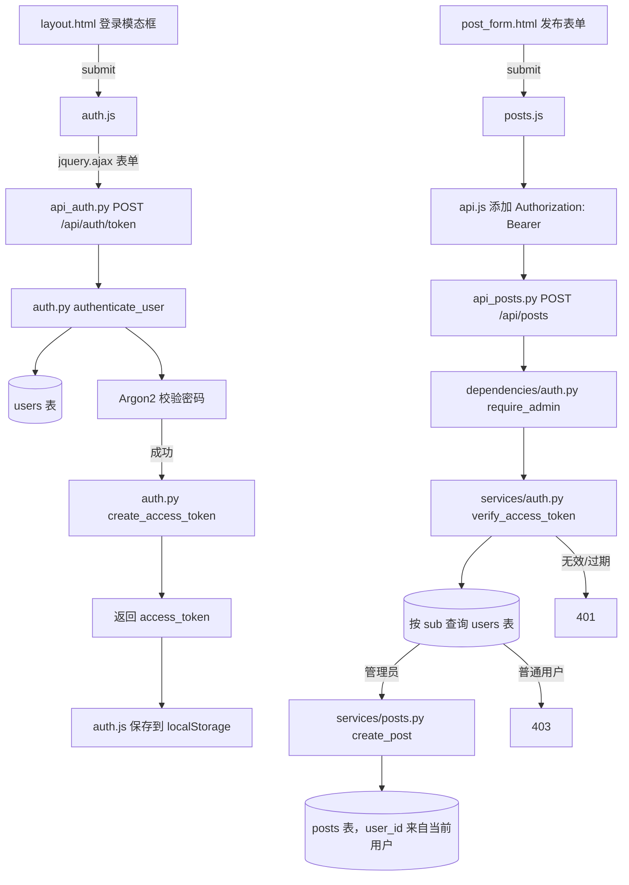

# JWT 与用户认证开发技术流程

本文描述当前项目的双 Token 认证：短期 JWT Access Token 负责访问 API，随机 Refresh Token 通过 HttpOnly Cookie 传输，服务端 `refresh_sessions` 表负责刷新、空闲时间和撤销状态。帖子新增、修改和删除仍要求管理员身份。

## 1. 开发目标与边界

当前实现包含以下能力：

- 用户使用用户名或邮箱加密码登录，登录标识不区分大小写。
- 服务端验证密码后签发短期 JWT Access Token。
- 客户端通过 `Authorization: Bearer <token>` 访问受保护接口。
- 依赖函数解析 Token 并加载当前用户。
- 使用 `is_admin` 区分普通用户与管理员。
- Access Token 过期后通过 Refresh Cookie 换取新 Token。
- 服务端记录 Refresh Token 哈希、最近活动时间和撤销状态。
- 支持可配置的 Access 有效期、空闲超时和 Refresh 绝对有效期。
- 密码哈希、JWT 和数据库错误不会泄露到响应或日志。

当前仍未实现：

- 完整 CSRF Token 校验。
- 第三方 OAuth 登录。
- 邮箱验证、找回密码、多因素认证。
- 多角色 RBAC 权限表。

Access Token 仍是无状态 JWT，签发后不能修改其 `exp`；Refresh Session 是有状态会话，用来解决滑动空闲时间、轮换和撤销问题。两者分工后既保留 Bearer API 的简单性，又能由服务端控制长期登录状态。

## 2. 现有基础

| 现有内容 | 文件或依赖 | 用途 |
| --- | --- | --- |
| 用户表 | `app/models/user.py` | 保存用户名、邮箱、密码哈希和 `is_admin` |
| 密码哈希 | `pwdlib[argon2]` | 注册时生成 Argon2 哈希，登录时验证密码 |
| JWT | `PyJWT` | 编码和解码 Access Token |
| 安全配置 | `app/core/config.py` | 提供 `SECRET_KEY`、`ALGORITHM`、过期分钟数 |
| 数据库依赖 | `app/db/session.py` | 为认证依赖和登录 Service 提供 Session |
| Refresh Session | `app/models/refresh_session.py` | 保存 Token 哈希、用户、活动时间和撤销状态 |

`.env` 中的 `SECRET_KEY` 已被 Git 忽略。生产环境应由部署平台注入独立密钥，不能复制开发密钥，也不能将密钥写进代码、镜像或日志。

## 3. 已实现的模块

以下文件构成当前认证实现：

| 文件 | 计划职责 |
| --- | --- |
| `app/schemas/auth.py` | 定义 `TokenResponse` 响应契约 |
| `app/services/auth.py` | 验证 Argon2 密码、创建和解码 JWT |
| `app/dependencies/auth.py` | 提取 Bearer Token、加载当前用户并检查管理员权限 |
| `app/routers/api_auth.py` | 提供 `POST /api/auth/token` 登录接口 |
| `app/static/js/api.js` | 使用 `jquery.ajax` 封装 JSON、表单和 Bearer Header |
| `app/static/js/auth.js` | 提交登录/注册表单并管理当前标签页 Token |
| `app/static/js/posts.js` | 携带 Token 提交发布和编辑帖子表单 |
| `app/static/js/forms.js` | 使用 AJAX 提交搜索和个人资料表单 |
| `tests/test_auth.py` | 覆盖登录、Token 过期/伪造以及发帖权限 |
| `app/models/refresh_session.py` | 定义服务端 Refresh Session 表 |
| `migrations/versions/20260724_01_create_refresh_sessions.py` | 创建 Refresh Session 表和索引 |

## 3.1 编程代码流程图


```mermaid
flowchart TD
    A[layout.html 登录模态框] -->|submit| B[auth.js]
    B -->|jquery.ajax 表单| C[api_auth.py POST /api/auth/token]
    C --> D[auth.py authenticate_user]
    D --> E[(users 表)]
    D --> F[Argon2 校验密码]
    F -->|成功| G[auth.py create_access_token]
    G --> H[返回 access_token]
    H --> I[auth.js 保存到 localStorage]

    J[post_form.html 发布表单] -->|submit| K[posts.js]
    K --> L[api.js 添加 Authorization: Bearer]
    L --> M[api_posts.py POST /api/posts]
    M --> N[dependencies/auth.py require_admin]
    N --> O[services/auth.py verify_access_token]
    O --> P[(按 sub 查询 users 表)]
    P -->|管理员| Q[services/posts.py create_post]
    Q --> R[(posts 表，user_id 来自当前用户)]
    P -->|普通用户| S[403]
    O -->|无效/过期| T[401]
```

编写时先完成签发链，再完成验证链，最后把业务写接口接到权限依赖：

1. `schemas/auth.py` 先固定登录响应，防止 Router 随意暴露字段。
2. `services/auth.py` 完成密码验证及 JWT 编解码；`sub` 只保存用户主键。
3. `routers/api_auth.py` 解析 OAuth2 表单，认证成功才签发 Token。
4. `dependencies/auth.py` 从 Header 提取 Token、查库获得最新用户，并区分 401 与 403。
5. `routers/api_posts.py` 依赖 `require_admin`，用当前用户 ID 生成 `PostCreate`，不信任前端作者 ID。
6. `api.js` 统一封装 AJAX；具体表单模块只负责收集字段、展示错误和页面跳转。
7. `tests/test_auth.py` 验证正确登录、错误凭据、过期/伪造 Token、普通用户 403 和管理员成功。

`localStorage` 可以跨同源窗口共享，并会在浏览器重启后保留；它仍可被同源 JavaScript 读取，因此生产环境必须严格防范 XSS。Refresh Token 不进入 JavaScript，只通过 HttpOnly Cookie 传输。

双 Token 实现没有修改 `users` 表，但新增了 `refresh_sessions` 表，因此必须应用 `20260724_01_create_refresh_sessions` 迁移。

## 4. 登录与签发 Token

登录接口使用 FastAPI 的 `OAuth2PasswordRequestForm`，请求类型为 `application/x-www-form-urlencoded`：

```http
POST /api/auth/token
Content-Type: application/x-www-form-urlencoded

username=alice&password=password123
```

OAuth2 表单字段名固定为 `username`，本项目将该字段解释为“登录标识”。Service 使用 `func.lower()` 同时匹配 `User.username` 和 `User.email`，所以可以提交用户名或邮箱，且不区分大小写。

调用链：

```text
POST /api/auth/token
  → OAuth2PasswordRequestForm 解析 username/password
  → auth_service.authenticate_user()
      → 按 username 或 email 查询 User
      → verify_password(明文密码, hashed_password)
  → 验证失败：401 + WWW-Authenticate: Bearer
  → 验证成功：create_access_token(user.id)
      → 加入 sub、iat、exp
      → 使用 SECRET_KEY 和固定 ALGORITHM 签名
  → TokenResponse(access_token, token_type="bearer")
  → ApiSuccess.data 包裹 TokenResponse
```

无论用户名不存在还是密码错误，都返回相同的 `401 Invalid username or password`，避免攻击者通过响应差异枚举账号。

## 5. JWT Payload 设计

第一阶段只放必要声明：

```json
{
  "sub": "123",
  "iat": 1784700000,
  "exp": 1784701800
}
```

| Claim | 含义 |
| --- | --- |
| `sub` | 用户主键，统一编码为字符串 |
| `iat` | Token 签发时间，使用带时区的 UTC 时间 |
| `exp` | Token 过期时间，由 `ACCESS_TOKEN_EXPIRE_MINUTES` 计算 |

不要把密码哈希、邮箱、昵称或管理员状态放入 Token。`is_admin` 可能在 Token 有效期内被修改，授权时应从数据库读取当前用户，以数据库状态为准。

如果以后存在多个签发方或多个 API，再考虑增加 `iss` 和 `aud`；增加后编码和解码两端必须同时严格校验。

## 6. Token 编码与解码规则

编码时：

1. 从 `Settings` 读取 `SECRET_KEY`、`ALGORITHM` 和有效期。
2. 使用 `datetime.now(UTC)` 计算 `iat` 和 `exp`。
3. 调用 `jwt.encode(payload, secret, algorithm=algorithm)`。

解码时：

1. 从 Bearer Header 取得 Token。
2. 调用 `jwt.decode(token, secret, algorithms=[settings.algorithm])`。
3. 必须显式传入允许的算法列表，不能信任 Token Header 自己声明的算法。
4. 捕获过期、签名错误、格式错误和缺少 `sub`，统一转换成 `401`。
5. 将 `sub` 转换为整数并查询数据库；用户不存在也返回 `401`。

不要在日志中记录完整 Token。诊断时最多记录请求 ID、错误类型和不敏感的用户 ID。

## 7. 当前用户依赖

建议建立两个依赖层级：

```text
oauth2_scheme
  → 从 Authorization Header 提取 Bearer Token

get_current_user
  → 解码 Token
  → 校验 sub
  → 查询数据库用户
  → 返回 User 或抛出 401

require_admin
  → 依赖 get_current_user
  → 检查 user.is_admin
  → 普通用户返回 403
```

示意类型别名：

```python
CurrentUser = Annotated[User, Depends(get_current_user)]
AdminUser = Annotated[User, Depends(require_admin)]
```

认证和授权必须区分：

- `401 Unauthorized`：没有 Token、Token 无效、Token 过期或对应用户不存在。
- `403 Forbidden`：Token 有效、用户身份明确，但没有执行该操作的权限。

所有 `401` 响应应包含：

```http
WWW-Authenticate: Bearer
```

## 8. 接口保护建议

以下是符合当前个人博客需求的建议策略，实施前仍应确认：

| 接口 | 建议权限 |
| --- | --- |
| `POST /api/users` | 公开注册，或改为仅管理员创建，二选一 |
| `GET /api/users` | 仅管理员 |
| `GET /api/users/{id}` | 用户本人或管理员 |
| `PATCH /api/users/{id}` | 用户本人或管理员 |
| `DELETE /api/users/{id}` | 仅管理员；是否允许本人注销需单独决定 |
| `POST /api/posts` | 仅管理员 |
| 公开帖子查询 | 无需登录 |

所有权检查不能只依赖客户端提交的用户 ID。必须先从 Token 得到当前用户，再比较 `current_user.id` 与目标资源所有者。

`is_admin` 不能出现在普通注册或资料更新 Schema 中。管理员授予应通过受控流程完成。

## 9. 推荐开发顺序

### 阶段一：认证基础

1. 新增 `TokenResponse` Schema。
2. 在用户 Service 增加按用户名查询函数，或在认证 Service 中封装查询。
3. 新增密码验证函数，复用现有 `PasswordHash` 实例。
4. 新增 Access Token 编码、解码函数。
5. 测试正确密码、错误密码和不存在用户。

### 阶段二：登录接口

1. 新增 `/api/auth/token` Router。
2. 使用 `OAuth2PasswordRequestForm`，不要用 JSON 冒充 OAuth2 Password Flow。
3. 在 `app/routers/__init__.py` 导出并在 `app/main.py` 注册 Router。
4. 验证 Swagger `/docs` 的 Authorize 流程。

### 阶段三：身份依赖

1. 新增 `oauth2_scheme = OAuth2PasswordBearer(tokenUrl="/api/auth/oauth2-token")`。
2. 实现 `get_current_user`。
3. 新增一个只需登录的测试端点或直接保护目标业务接口。
4. 覆盖无 Header、错误格式、伪造 Token、过期 Token、缺少 `sub` 和用户不存在。

### 阶段四：授权

1. 实现 `require_admin`。
2. 根据确认后的权限表保护用户和帖子接口。
3. 分别测试管理员、普通用户和未登录用户。
4. 更新 `docs/用户接口.md` 和 `docs/开发流程.md`，把权限要求从“计划”改成“现状”。

## 10. 测试矩阵

| 场景 | 预期结果 |
| --- | --- |
| 正确用户名或邮箱和密码 | `200`，返回 Bearer Token |
| 用户不存在 | `401`，不暴露账号是否存在 |
| 密码错误 | `401`，响应与用户不存在一致 |
| 缺少 Authorization Header | `401` |
| Token 签名被修改 | `401` |
| Token 已过期 | `401` |
| Token 缺少或包含非法 `sub` | `401` |
| Token 用户已被删除 | `401` |
| 普通用户访问管理员接口 | `403` |
| 管理员访问管理员接口 | 成功 |
| 响应和日志 | 不含明文密码、哈希、密钥和完整 Token |

测试继续使用内存 SQLite 和 `dependency_overrides[get_db]`，不得读取开发数据库中的历史用户。Token 过期测试应注入时间或直接生成已过期 Token，不使用 `sleep()`。

## 11. 安全检查清单

- `SECRET_KEY` 足够随机，未进入 Git；生产环境使用独立值。
- 解码算法来自服务端配置，不来自 Token Header。
- Access Token 有较短有效期，默认 30 分钟需要按部署风险评估。
- 全站生产流量使用 HTTPS，防止 Bearer Token 被窃听。
- 不在 URL、日志、异常或前端错误上报中暴露 Token。
- 密码只使用 Argon2 验证，不自行比较哈希字符串。
- 登录失败响应保持一致，并考虑在网关或中间件增加速率限制。
- 浏览器端避免把长期 Token 放入容易受 XSS 读取的存储；若改用 Cookie，必须同时设计 `HttpOnly`、`Secure`、`SameSite` 和 CSRF 防护。
- 密钥轮换会让旧 Token 失效；生产轮换前需要设计兼容窗口或接受全部重新登录。

## 12. 双 Token 模式设计

### 12.1 为什么不只使用一个 JWT

单个 JWT 存在安全和体验冲突：有效期很短时用户频繁登录，有效期很长时 Token 泄露后的可用窗口过大。项目将职责拆开：

| 凭据 | 作用 | 保存位置 | 特点 |
| --- | --- | --- | --- |
| Access Token | 调用业务 API | `localStorage`，通过 Bearer Header 发送 | JWT、短期、服务端不保存 Token 本身 |
| Refresh Token | 换取新 Access Token | HttpOnly Cookie | 高熵随机字符串，JavaScript 无法读取 |
| Refresh Session | 控制长期登录状态 | 数据库 | 保存 Refresh Token 哈希、空闲时间和撤销状态 |

双 Token 的主要收益：

- Access Token 可以保持较短有效期，减少泄露后的有效窗口。
- Refresh Token 不暴露给 JavaScript，降低 XSS 同时窃取长期凭据的风险。
- 服务端可以实现空闲超时、主动撤销、设备会话管理和登录审计扩展。
- 多个同源浏览器窗口自动共享 Refresh Cookie；Access Token 使用 `localStorage` 共享。
- Access Token 失效后，前端可以无感刷新并重试原请求。

双 Token 不能替代 HTTPS、XSS 防护和 CSRF 防护。Access Token 放在 `localStorage` 仍然可被同源恶意脚本读取。

### 12.2 Refresh Session 数据结构

`refresh_sessions` 表保存：

| 字段 | 含义 |
| --- | --- |
| `id` | 会话主键 |
| `user_id` | 会话属于哪个用户 |
| `token_hash` | Refresh Token 的 SHA-256 哈希，不保存明文 |
| `expires_at` | 会话绝对过期时间 |
| `last_activity_at` | 最近一次成功认证的业务活动时间 |
| `revoked` | Token 是否已被轮换、撤销或判定过期 |

浏览器持有随机 Refresh Token，服务器只保存哈希。收到 Cookie 后，服务端再次计算 SHA-256 并按 `token_hash` 查询；数据库泄露时，哈希不能直接当作 Cookie 使用。

### 12.3 可配置时间

配置位于 `app/core/config.py`：

| 环境变量 | 默认值 | 作用 |
| --- | --- | --- |
| `ACCESS_TOKEN_EXPIRE_MINUTES` | `30` | JWT Access Token 有效期 |
| `REFRESH_IDLE_TIMEOUT_MINUTES` | `30` | 连续无受保护请求多久后会话失效 |
| `REFRESH_TOKEN_EXPIRE_MINUTES` | `10080` | Refresh Session 绝对最长寿命，默认 7 天 |
| `AUTH_COOKIE_SECURE` | `false` | 是否只允许 HTTPS 发送 Cookie；生产必须为 `true` |

调试 2 分钟 Access、5 分钟空闲超时：

```powershell
$env:ACCESS_TOKEN_EXPIRE_MINUTES = "2"
$env:REFRESH_IDLE_TIMEOUT_MINUTES = "5"
$env:REFRESH_TOKEN_EXPIRE_MINUTES = "30"
```

修改后必须重启 FastAPI。已经签发的 Access Token 不会因为配置变化而修改 `exp`。

### 12.4 后端文件职责

```text
app/core/config.py
  → 定义 Access、Refresh、Idle 和 Cookie 配置

app/models/refresh_session.py
  → 定义 refresh_sessions 表

app/services/auth.py
  → hash_password / verify_password
  → create_access_token / verify_access_token
  → create_refresh_session
  → rotate_refresh_session
  → touch_refresh_session

app/routers/api_auth.py
  → POST /api/auth/token：登录并设置 Refresh Cookie
  → POST /api/auth/refresh：轮换 Refresh Token 并返回新 Access Token
  → POST /api/auth/logout：删除 Refresh Cookie

app/dependencies/auth.py
  → 验证 Bearer Access Token
  → 查询数据库用户
  → 更新 Refresh Session 最近活动时间
  → 检查管理员权限
```

Router 只处理 HTTP 表单、Cookie、响应和状态码；Service 处理 Token 与数据库会话规则；Dependency 把认证过程接入受保护业务接口。

#### 12.4.1 Python 文件与函数代码地图

| 文件 | 函数或对象 | 输入 | 输出或副作用 | 调用方 |
| --- | --- | --- | --- | --- |
| `app/core/config.py` | `Settings` | 环境变量和 `.env*` | 校验并提供 Token、空闲时间和 Cookie 配置 | Auth Service、Auth Router |
| `app/schemas/auth.py` | `TokenResponse` | `access_token` | 过滤登录/刷新 JSON 响应，只暴露 Access Token 和类型 | `login()`、`refresh()` |
| `app/models/refresh_session.py` | `RefreshSession` | ORM 字段 | 映射 `refresh_sessions` 表 | Auth Service |
| `app/services/auth.py` | `hash_password()` | 明文密码 | 在线程中生成 Argon2 哈希 | 用户注册、修改密码 |
| `app/services/auth.py` | `verify_password()` | 明文密码、数据库哈希 | 返回是否匹配 | `authenticate_user()` |
| `app/services/auth.py` | `authenticate_user()` | Session、用户名或邮箱、密码 | 成功返回 `User`，失败返回 `None` | 登录 Router |
| `app/services/auth.py` | `create_access_token()` | 用户主键、可选过期时间 | 返回带 `sub/iat/exp` 的 JWT | 登录、刷新 Router |
| `app/services/auth.py` | `verify_access_token()` | JWT 字符串 | 验签并返回整数用户 ID，失败抛 PyJWT/转换异常 | `get_current_user()` |
| `app/services/auth.py` | `_hash_refresh_token()` | Refresh Token 明文 | 返回 SHA-256 十六进制哈希 | Refresh Session 查询和创建 |
| `app/services/auth.py` | `create_refresh_session()` | Session、用户 ID | 插入数据库并返回只交给 Cookie 的随机 Token | 登录、轮换 |
| `app/services/auth.py` | `rotate_refresh_session()` | Session、Cookie Token | 验证、撤销旧会话，返回用户 ID 和新 Token | `/api/auth/refresh` |
| `app/services/auth.py` | `touch_refresh_session()` | Session、Cookie Token、用户 ID | 校验空闲/绝对过期并更新最近活动时间 | `get_current_user()` |
| `app/dependencies/auth.py` | `oauth2_scheme` | Authorization Header | 提取 Bearer Token；缺失时返回 401 | `get_current_user()` |
| `app/dependencies/auth.py` | `get_current_user()` | Access Token、Session、Refresh Cookie | 返回数据库中的最新 `User`，并更新活动时间 | 所有受保护接口 |
| `app/dependencies/auth.py` | `require_admin()` | 当前用户 | 管理员返回 `User`，普通用户返回 403 | 帖子写接口、图片上传 |
| `app/routers/api_auth.py` | `login()` | OAuth2 用户名密码表单 | 返回 Access JSON，设置 Refresh HttpOnly Cookie | 前端登录表单 |
| `app/routers/api_auth.py` | `refresh()` | Refresh Cookie | 轮换会话，返回新 Access，覆盖 Refresh Cookie | `api.js` 401 处理 |
| `app/routers/api_auth.py` | `logout()` | 当前请求与响应对象 | 删除 Refresh Cookie，返回统一 200 成功响应 | 前端退出按钮 |
| `migrations/versions/20260724_01_create_refresh_sessions.py` | `upgrade()` | 当前数据库 | 创建表、外键、唯一索引和用户索引 | `alembic upgrade head` |

#### 12.4.2 后端调用顺序为什么这样分层

```text
Router
  只认识 HTTP：表单、Cookie、状态码、Set-Cookie
        ↓
Service
  只实现认证规则：密码、JWT、Refresh Session、事务
        ↓
Model
  只描述数据库结构和关系

Dependency
  把 Service 的认证结果接入业务 Router：401、403、当前用户
```

这样拆分后，`create_access_token()` 不依赖 FastAPI Request，能够直接单元测试；`login()` 不需要知道 SHA-256 和 SQL 查询细节；业务 Router 只声明 `current_user: AdminUser` 就能复用完整认证链。

### 12.5 登录时序

```mermaid
sequenceDiagram
    participant Browser as 浏览器
    participant Ajax as auth.js
    participant Router as api_auth.py
    participant Service as services/auth.py
    participant DB as 数据库

    Browser->>Ajax: 提交用户名和密码
    Ajax->>Router: POST /api/auth/token
    Router->>Service: authenticate_user()
    Service->>DB: 查询 User
    Service->>Service: verify_password()
    Service->>Service: create_access_token()
    Service->>DB: 保存 Refresh Token Hash
    Router-->>Browser: JSON Access Token
    Router-->>Browser: Set-Cookie Refresh Token; HttpOnly
    Ajax->>Browser: Access Token 保存到 localStorage
```

Refresh Token 不出现在 JSON 响应，也不能被 `auth.js` 读取。

### 12.6 访问受保护接口与空闲续期

```text
业务 AJAX
  → 从 localStorage 读取 Access Token
  → Authorization: Bearer <token>
  → oauth2_scheme 提取 Token
  → verify_access_token 校验签名和 exp
  → 按 sub 查询 User
  → HttpOnly Refresh Cookie 自动随请求发送
  → touch_refresh_session 更新 last_activity_at
  → require_admin 检查 is_admin
  → 执行业务 Router
```

空闲超时是滑动时间：每次成功的受保护请求都会更新 `last_activity_at`，但不应延长 Refresh Session 的绝对过期时间。连续无操作超过 `REFRESH_IDLE_TIMEOUT_MINUTES` 后，会话必须重新登录。

### 12.7 Access Token 过期与 AJAX 重试

前端公共入口是 `app/static/js/api.js`：

```text
ajaxRequest(options)
  → 添加 Authorization Header
  → 发出业务请求
  → 成功：resolve 原结果
  → 401：POST /api/auth/refresh
      → 浏览器自动携带 HttpOnly Cookie
      → 成功：保存新 Access Token
      → 使用原参数重试业务请求
      → 失败：reject，由页面提示重新登录
```

jQuery `Deferred` 用来让调用页面只等待一个最终结果。注册、发帖和资料模块无需各自复制 Refresh 逻辑：

```javascript
ajaxRequest({
    url: "/api/posts",
    method: "POST",
    auth: true,
    data: postData,
})
    .done(handleSuccess)
    .fail(handleError);
```

前端不能主动读取 Refresh Token；调用 `/api/auth/refresh` 时，浏览器根据 Cookie 的 Domain、Path、SameSite 和 Secure 属性自动发送。

#### 12.7.1 前端文件与函数代码地图

| 文件 | 函数或事件 | 负责内容 | 不负责内容 |
| --- | --- | --- | --- |
| `app/static/js/api.js` | `getToken()` | 从 `localStorage` 读取 Access Token | 不能读取 HttpOnly Refresh Cookie |
| `app/static/js/api.js` | `saveToken()` | 保存登录或刷新得到的新 Access Token | 不验证 JWT 内容 |
| `app/static/js/api.js` | `clearToken()` | 删除本地 Access Token | 当前实现不撤销数据库会话 |
| `app/static/js/api.js` | `ajaxRequest()` | 统一 JSON/表单请求、Bearer Header、401 刷新和原请求重试 | 不处理具体页面成功文案 |
| `app/static/js/api.js` | `uploadFile()` | 使用 `FormData` 上传图片并添加 Bearer Header | 当前尚无 401 刷新重试 |
| `app/static/js/api.js` | `errorMessages()` | 把 FastAPI `detail` 转成页面可显示文本 | 不记录完整 Token |
| `app/static/js/auth.js` | 登录 submit | 序列化 OAuth2 表单，保存 Access Token，刷新页面 | 无法读取 Refresh Cookie |
| `app/static/js/auth.js` | 注册 submit | 把注册字段作为 JSON 发送 | 不创建管理员 |
| `app/static/js/auth.js` | 退出 click | 调用后端 logout，清理 Access Token | 当前后端尚未撤销数据库 Refresh Session |
| `app/static/js/posts.js` | 帖子 submit | 获取 Markdown，调用受保护帖子 API | 不自行实现刷新流程 |
| `app/static/js/posts.js` | 图片 Hook | 调用 `uploadFile()` 获取图片 URL并插入 Markdown | 不把图片转 Base64 存入正文 |
| `app/static/js/forms.js` | 资料 submit | 通过 `ajaxRequest(auth=true)` 修改资料 | 不直接拼接 Authorization Header |

#### 12.7.2 `ajaxRequest()` 内部执行步骤

```text
调用方传入
  url / method / data / formEncoded / auth
        ↓
auth=true 且 localStorage 有 Token
  headers.Authorization = "Bearer ..."
        ↓
request() 创建 $.ajax
        ↓
成功
  deferred.resolve(result)
        ↓
失败但不是 auth 401
  deferred.reject(xhr)
        ↓
auth 401
  POST /api/auth/refresh
        ↓
浏览器自动附带 HttpOnly Refresh Cookie
        ↓
刷新成功
  saveToken(newAccessToken)
  retryAfterRefresh() 使用原参数重发
        ↓
刷新失败
  deferred.reject(refreshXhr)
```

调用页面得到的是 `deferred.promise()`，因此不必区分“第一次成功”还是“刷新后重试成功”：

```javascript
ajaxRequest(options)
    .done((result) => {
        // 两条成功路径最终都会到这里。
    })
    .fail((xhr) => {
        // 原请求失败或 Refresh 失败最终都会到这里。
    });
```

#### 12.7.3 登录页面的精确执行链

```text
layout.html 登录模态框
  → data-login-form submit
  → auth.js event.preventDefault()
  → $form.serialize()
  → ajaxRequest(formEncoded=true)
  → POST /api/auth/token
  → 后端 Set-Cookie refresh_token（浏览器自动保存）
  → JSON 返回 data.access_token
  → api.js 自动解包 data
  → saveToken(access_token)
  → localStorage[blog-access-token]
  → window.location.reload()
```

页面刷新后，`auth.js` 通过 `Boolean(getToken())` 控制访客和已登录按钮；这只是前端显示状态，真正权限始终由后端 JWT、数据库用户和 `require_admin()` 判断。

#### 12.7.4 发布帖子的精确执行链

```text
post_form.html
  → posts.js 从 Toast UI 读取 getMarkdown()
  → ajaxRequest({auth: true})
  → api.js 添加 Bearer Header
  → POST /api/posts
  → get_current_user()
      → verify_access_token()
      → 查询 User
      → touch_refresh_session()
  → require_admin()
  → api_posts.create_post()
  → posts Service 写数据库
  → 返回 PostResponse
  → 前端跳转 /posts/{id}
```

#### 12.7.5 多窗口中的 Token 行为

`localStorage` 和同源 Cookie 都会在同源窗口间共享：一个窗口登录后，另一个窗口重新加载即可读取 Access Token；Refresh Cookie 始终由浏览器管理。某个窗口刷新 Access Token 后，`localStorage` 中的新值也能被其他窗口读取，但已经发送出去的并发请求不会自动改变，因此多窗口同时遇到 401 时仍可能发生 Refresh 轮换竞争。

### 12.8 退出流程

```text
点击退出
  → POST /api/auth/logout
  → 服务端删除 Refresh Cookie
  → 前端删除 localStorage Access Token
  → 页面刷新为未登录状态
```

Access Token 是无状态 JWT，退出后在自身 `exp` 前仍可能有效；因此它必须保持短期。完整的服务端退出还应撤销数据库中的当前 Refresh Session。

### 12.9 当前实现状态与待修正项

当前已经实现双 Token 骨架、Refresh Session 表、Token 哈希、Cookie、空闲时间更新、轮换接口和普通 AJAX 的 401 刷新重试。以下内容属于明确的后续修正，不能当成已完成行为：

1. Refresh Token 轮换目前会以刷新时刻重新计算 `expires_at`；应继承原会话绝对过期时间，防止持续刷新无限延长。
2. `/api/auth/logout` 目前删除 Cookie，但尚未把数据库当前 Refresh Session 标记为 `revoked=True`。
3. `uploadFile()` 尚未复用普通 `ajaxRequest()` 的刷新重试逻辑，Access Token 过期时图片上传可能直接返回 401。
4. 当前主要依赖 `SameSite=Lax` 降低 CSRF 风险；生产方案仍应补充 CSRF Token 或严格的 Origin 校验。
5. 多窗口同时刷新可能产生轮换竞争，需要单次刷新锁或前端跨窗口协调。

## 13. 验证命令

实施认证后至少运行：

```powershell
uv run ruff check app migrations tests
uv run pytest tests/test_auth.py -vv
uv run pytest -q
uv run alembic check
```

双 Token 新增了 `refresh_sessions` 表。运行 `alembic check` 前必须先在确认过的目标数据库执行：

```powershell
$env:PYTHONPATH = (Get-Location).Path
uv run alembic upgrade head
```

升级后 `alembic check` 才应输出 `No new upgrade operations detected`。未经确认不得对生产或需要保留数据的数据库执行迁移。
